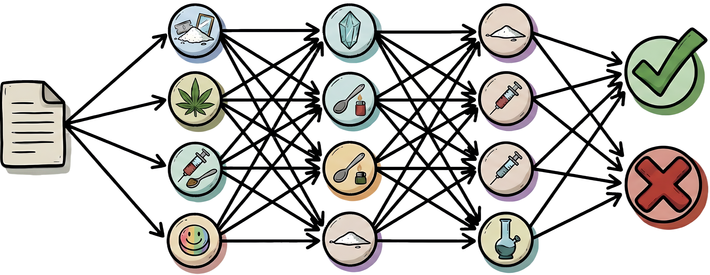

<p align="center">
  
</p>
<h3 align="center">Drugs Usage Models Creator</h3>
<p align="center">Core engine for training, evaluating, and exporting specialized drug-consumption detection models<p>
<p align="center">
    
    
</p>

---
# Drugs Usage Models Creator

## Project Purpose
This project aims to create models for the detection of "Adverse Human Behaviors" (specifically illicit drug consumption) from a Spanish Twitter corpus using various Machine Learning and Deep Learning techniques.

## Repository Structure

The project follows a structured architecture for reproducibility and maintainability:

- **/data**: Contains datasets.
  - `raw/`: Original, immutable CSV files.
  - `processed/`: Cleaned and transformed datasets ready for modeling.
- **/src**: Source code for the project.
  - `preprocessing/`: Scripts for data cleaning and preparation.
  - `features/`: Feature engineering logic.
  - `training/`: Scripts to train models.
  - `models/`: Model architecture definitions.
- **/models**: Stores trained model binaries and checkpoints.
- **/notebooks**: Jupyter notebooks for Exploratory Data Analysis (EDA) and initial experiments.
- **/evaluation**: Contains evaluation metrics, confusion matrices, and plots.

## Setup Instructions

### Prerequisites
- [pyenv](https://github.com/pyenv/pyenv) with **Python 3.12.12** installed (`pyenv install 3.12.12`)

### 1. Create the virtual environment
```bash
# Use pyenv's Python 3.12.12 to create the venv
~/.pyenv/versions/3.12.12/bin/python -m venv .venv

# Activate the venv
source .venv/bin/activate

# Upgrade pip
pip install --upgrade pip
```

### 2. Install dependencies
```bash
pip install -r requirements.txt
```

### 3. Launch JupyterLab
```bash
source .venv/bin/activate
jupyter lab
```
---

## License

[MIT](https://choosealicense.com/licenses/mit/)

### Logo License

Generated with AI

### Matplotlib style

The [style.mplstyle](./style.mplstyle) file was obtained from the following [repository](https://github.com/DataForScience/Networks/blob/master/d4sci.mplstyle) 